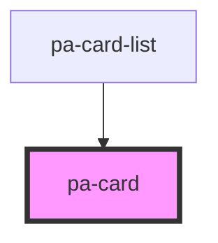

# pa-card

<!-- Auto Generated Below -->

## Properties

| Property   | Attribute   | Description | Type     | Default     |
| ---------- | ----------- | ----------- | -------- | ----------- |
| `cardData` | `card-data` |             | `string` | `undefined` |

## Events

| Event              | Description                | Type                    |
| ------------------ | -------------------------- | ----------------------- |
| `cardViewSelected` | custom event to emit value | `CustomEvent<CardData>` |

## Dependencies

### Used by

 - [pa-card-list](../card-list)

### Graph

----------------------------------------------

*Built with [StencilJS](https://stenciljs.com/)*
